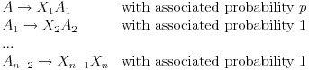
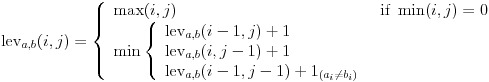
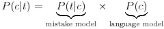
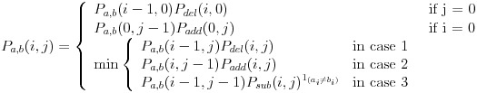
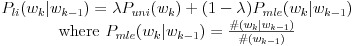
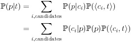

Probabilistic French parser
========================================

## Introduction

This repositery is an implementation of a probabilistic parser for French natural sentences. The parser is based on the SEQUOIA dataset.

### Usage

## PCFG extraction

### Dataset

We extract a probabilistic context-free grammar by parsing the [SEQUOIA treebank dataset](https://www.rocq.inria.fr/alpage-wiki/tiki-index.php?page=CorpusSequoia). The dataset is given as a bracketed set of 3099 lines corresponding to sentences and the associated grammatical structure of the sentence. The PCFG is created by counting the number of times the rules have been seen associated to a certain head. Overall, we find 2929 different rules in the dataset.

### Chomsky normal form

In order to apply the CYK algorithm for probabilistic parsing, we need to convert our PCFG into Chomsky normal form, that is to say rules have to be of the form A &rarr; BC or  A &rarr; a where a is a terminal symbol or S &rarr; e where e is the empty word. To convert our PCFG into normal form, we have to apply a certain set of rules:

 - START: eliminate start symbols from right hand side
 
 - TERM: eliminate rules with non-solitary terminals
 
 - BIN: replace each rule
     A &rarr; X1 ... Xn
     with associated probability p by a set of rules
	

 - UNIT: eliminate unit rules. A unit rule is a rule of the form A &rarr; B with associated probability p, where A, B are non-terminal symbols. To remove it, for each rule B&rarr; X1 ... Xn where X1 ... Xn is a string of nonterminals and terminals with associated probability p', add rule A&rarr; X1 ... Xn with associated probability pp'.
	Notice this rule is problematic, since even though the language generated by the PCFG is still the same after applying this rule, when applying the algorithm we will not be able to reconstruct the intermediate rules. The way to overcome this problem is by remembering the rules we erase: when generating the parse, we can either choose the rule with maximal probability, or randomly sample one of these rules with the distribution associated to the probabilities of these sequences of rules.

## OOV module

We want our parser to be able to handle unknown words, which means we need to identify the part-of-speech tags associated to words we did not encountered in the dataset. We can identify two causes for encountering an unknown word: the first is we genuinely never encoutered the word, and the second is that there is a spelling mistake in the input word. For these reasons, we are going to build two modules: the first one is basically a spell correcter, that returns a list of most probable corrections for an input word, and the second one is a similarity measure between words.

### Spell checker

To compute candidates for spelling correction, we are going to search for words that are at distance at most 2 from the input word, where the distance between two words is given by the minimal number of transformations to go from one to the other. The allowed transformations are insertion of a character, deletion of a caracter, and substitution of two characters. This distance, called the Levenshtein distance, can be easily computed by a dynamic programming algorithm. If we denote by lev(i, j) the number of operations necessary to go from the i-prefix of a to the j-prefix of b, we have:

In addition to this, we are going to compute the probability of a given candidate word to be mistakenly spelled as the input word. To do so, we are going to use the spelling noisy model in the article [A Spelling Correction Program Based on a Noisy Channel Model](http://www.aclweb.org/anthology/C90-2036). This paper gives tables with frequencies of a given insertion/deletion/substitution error to happen. This allows us to compute the probability associated to a candidate. Given an input word t and a candidate c, Bayes rule yields:

The mistake model in the previous equation corresponds to a certain spelling error happening, and can easily be computed by adapting the function used for computing the Levenshtein distance, since the computation of the minimum corresponds to identifying one of the three allowed transformations, and thus the probability associated to this transformation can be used. If we denote P(i, j) the probability of mistakenly typing the j-prefix of b instead of the i-prefix of a, and we denote Pdel(i, j), Padd(i, j) and Psub(i, j) the probabilities of respectively deletion, addition and substitution, and name case 1, 2, 3 the cases corresponding to the min in the definition of the Levenshtein distance, we have

This allows us to implement a dynamic programming algorithm that computes the levenshtein distance between two words, and the probability associated to this mistake.

We know need to implement a language model. This language model corresponds to the probability to inserting the candidate given the context of the sentence. We could use 1-gram or 2-gram probabilities and, but we are going to use an intermediate interpolated probability

We also use add-1 smoothing to allow for unseen sequences. Recombining the two models, we can compute a list of candidates, by computing the Levenshtein distance between all words in our lexicon and the input word, and only keeping the words at a distance of at most 1 (or 2).

### Polyglot similarity

The limit of the previous approach is that our list may be empty, or the obtained candidates may be highly improbable. In that case, it is reasonable to think that the input word is actually not a mistake, but is absent from our lexicon. In that case, we are going to use word embedding to compute a similarity between words. We are going to use the [Polyglot dataset](https://sites.google.com/site/rmyeid/projects/polyglot). Without going into too much detail, this is a light embedding that allows to encode both syntactic and semantic information about the words, as illustrated figure on the figure below.

| syntactic (global level) clustering |  semantic (local level) clustering |
|-------------------------------------|------------------------------------|
| |  |

In the case where the word is not obtained by simple spelling correction, we get its PoS by voting over its k nearest neighbours in the lexicon, according to L2 distance between word embeddings.

### PoS attribution

The spell checker gives us a set of candidates words and associated weights. Similarly, the words embedding gives us a set of candidates. The probability of a candidate c and the original word t sharing the same PoS is defined as

Finally, the probability of t having the PoS p is given by

## Parsing

### Probabilistic CYK algorithm

The Cocke-Younger-Kasami (CYK) algorithm is a parsing algorithm for context-free grammars. For a given sentence and a CFG in Chomsky normal form, the algorithm returns whether or not the input sentence can be generated from the CFG. We implement a probabilistic version of this algorithm, giving the most probable parse of the input sentence, if it exists. The pseudocode of the algorithm is the following

The parse can then be inferred using the array `back`.
